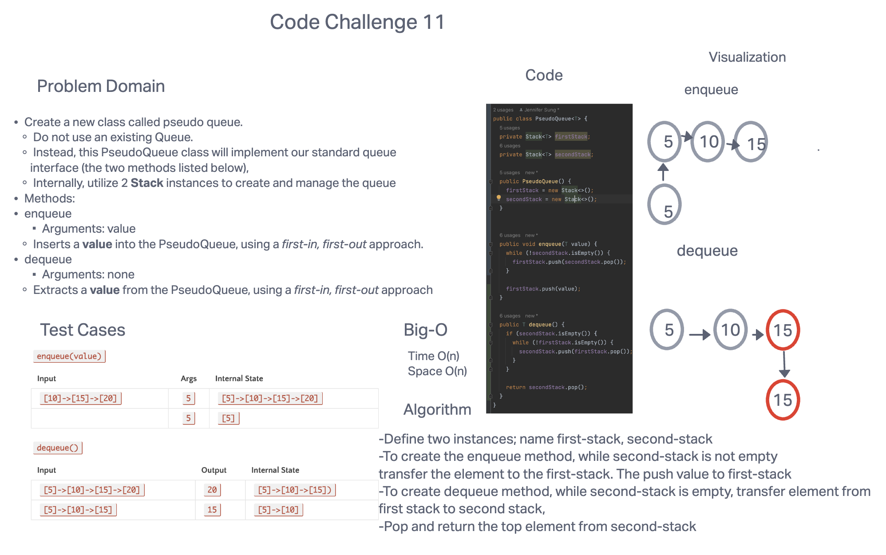

# Code Challenge: Class 11: Implement a Queue using two Stacks.

## Feature Tasks
### Create a new class called pseudo queue.
* Do not use an existing Queue.
* Instead, this PseudoQueue class will implement our standard queue interface (the two methods listed below),
* Internally, utilize 2 Stack instances to create and manage the queue

### Methods:

* enqueue
Arguments: value
Inserts a value into the PseudoQueue, using a first-in, first-out approach.
* dequeue
Arguments: none
Extracts a value from the PseudoQueue, using a first-in, first-out approach.
NOTE: The Stack instances have only push, pop, and peek methods. You should use your own Stack implementation. Instantiate these Stack objects in your PseudoQueue constructor.
## Whiteboard Process

## Approach & Efficiency
The time and space complexity is O(n) of both methods because om the worth case scenario, either methods will require the elements between these two stack to be transferred b/w them.
## Solution
[ stack-queue-pseudo](https://github.com/jennisung/data-structures-and-algorithms/blob/main/java/datastructures/lib/src/main/java/codechallenges/linkedlist/pseudoqueue.java)
