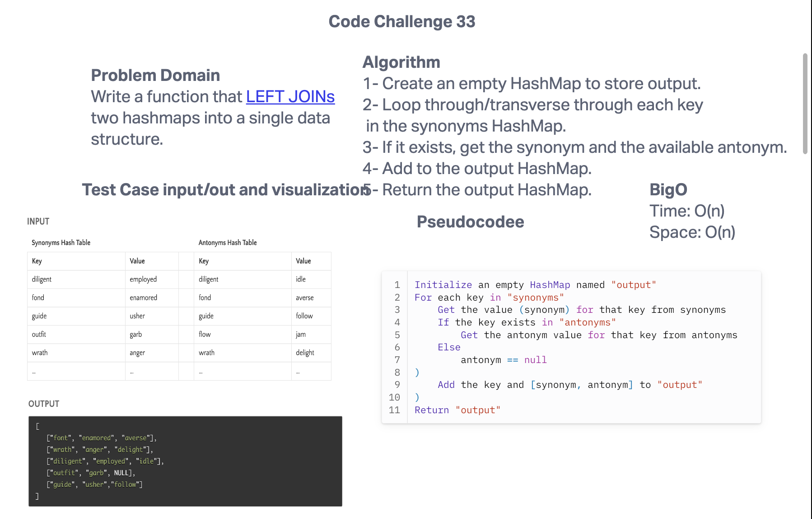

# Code Challenge 33
Write a function that LEFT JOINs two hashmaps into a single data structure.

* Write a function called left join
* Arguments: two hash maps
  * The first parameter is a hashmap that has word strings as keys, and a synonym of the key as values.
  * The second parameter is a hashmap that has word strings as keys, and antonyms of the key as values.
* Return: The returned data structure that holds the results is up to you. It doesn’t need to exactly match the output below, so long as it achieves the LEFT JOIN logic
## Whiteboard Process


## Approach & Efficiency
Both time and space complexity would be O(n).

## Solution
```public class LeftJoin {
  public static HashMap<String, String[]> leftJoin(HashMap<String, String> synonyms, HashMap<String, String> antonyms) {
    HashMap<String, String[]> output = new HashMap<>();

    for (String key : synonyms.keySet()) {
      String synonym = synonyms.get(key);

      String antonym;
      if (antonyms.containsKey(key)) {
        antonym = antonyms.get(key);
      } else {
        antonym = null;
      }

      output.put(key, new String[] {synonym, antonym});
    }

    return output;
  }```
