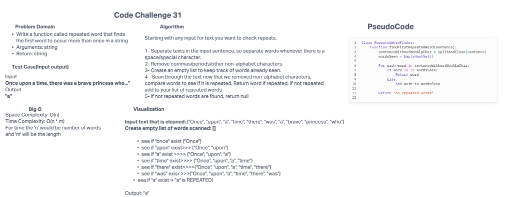

# Code Challenge 31: Find the first repeated word in a book
Write a function called repeated word that finds the first word to occur more than once in a string
Arguments: string
Return: string

## Whiteboard Process


## Approach & Efficiency

The BigO for this problem will be as follows; for the space Complexity it will be O(n). And for the Time Complexity: O(n * m). For time the 'n' would be number of words and 'm' will be the length.

## Solution
```public class hashmapRepeatedWord {
  public static String findRepeatedWord(String sentence) {

    String inputWithoutNonAlpChar = sentence.replaceAll("[^a-zA-Z ]", "").toLowerCase();
    String[] words = inputWithoutNonAlpChar.split("\\s+");

    Map<String, Integer> trackWord = new HashMap<>();

    for (String word : words) {
      if (trackWord.containsKey(word)) {
        return word;
      }
      trackWord.put(word, 1);
    }

    return null;
  }
}
