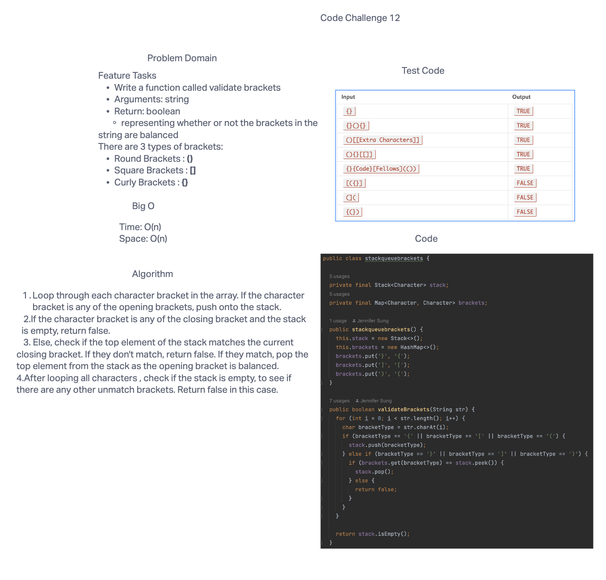

# Code Challenge: Class 13
### Feature Tasks

* Write a function called validate brackets
* Arguments: string
* Return: boolean
representing whether or not the brackets in the string are balanced

* There are 3 types of brackets:
* Round Brackets : ()
* Square Brackets : []
* Curly Brackets : {}

## Whiteboard Process

## Approach & Efficiency

I guess my first approach to this problem is that we know we need to check if the bracket pairs match, so we need to loop through the characters.
The big O complexity is O(n) for both time and space.

## Solution
* [ Multi-bracket Validation](https://github.com/jennisung/data-structures-and-algorithms/blob/main/java/datastructures/lib/src/main/java/codechallenges/linkedlist/stackqueuebrackets.java)
