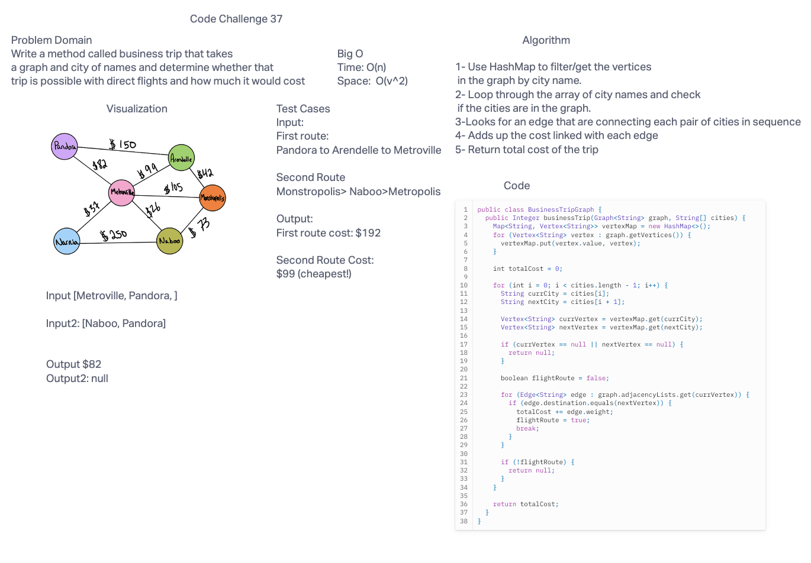

# Code Challenge
* Write a function called business trip
* Arguments: graph, array of city names
* Return: the cost of the trip (if it’s possible) or null (if not)
Determine whether the trip is possible with direct flights, and how much it would cost.


## Whiteboard Process



## Approach & Efficiency
The time complexity is O(n) and space is O(v^2).

## Solution
```public class BusinessTripGraph {
  public Integer businessTrip(Graph<String> graph, String[] cities) {
    Map<String, Vertex<String>> vertexMap = new HashMap<>();
    for (Vertex<String> vertex : graph.getVertices()) {
      vertexMap.put(vertex.value, vertex);
    }

    int totalCost = 0;

    for (int i = 0; i < cities.length - 1; i++) {
      String currCity = cities[i];
      String nextCity = cities[i + 1];

      Vertex<String> currVertex = vertexMap.get(currCity);
      Vertex<String> nextVertex = vertexMap.get(nextCity);

      if (currVertex == null || nextVertex == null) {
        return null;
      }

      boolean flightRoute = false;

      for (Edge<String> edge : graph.adjacencyLists.get(currVertex)) {
        if (edge.destination.equals(nextVertex)) {
          totalCost += edge.weight;
          flightRoute = true;
          break;
        }
      }

      if (!flightRoute) {
        return null;
      }
    }

    return totalCost;
  }
}```
