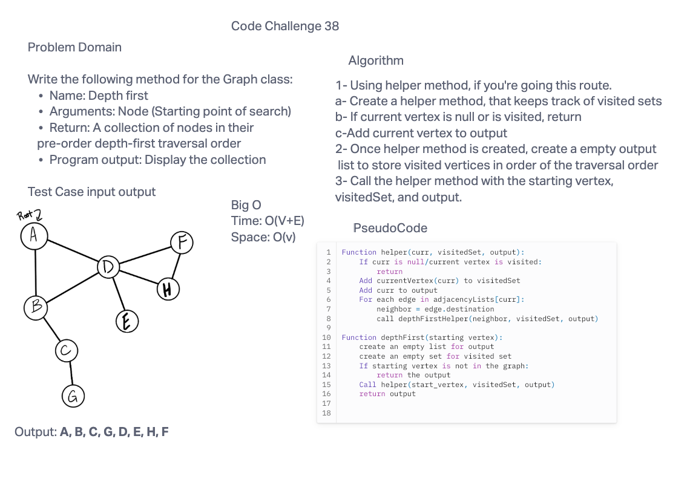

# Code Challenge #38
Write the following method for the Graph class:
* Name: Depth first
* Arguments: Node (Starting point of search)
* Return: A collection of nodes in their pre-order depth-first traversal order
* Program output: Display the collection

## Whiteboard Process




## Approach & Efficiency
The recursive method visits all the connected nodes from a starting point, and mark/track them as visited using a hashset, and then adding them to a list in the order they were visited.
The BigO time complexity is O(V+E) and space O(v)
## Solution
```
public void depthFirstHelper(Vertex<T> curr, Set<Vertex<T>> visitedSet, List<Vertex<T>> visitedList) {
    if (curr == null || visitedSet.contains(curr)) {
      return;
    }

    visitedSet.add(curr);
    visitedList.add(curr);

    for (Edge<T> edge : adjacencyLists.get(curr)) {
      Vertex<T> neighbor = edge.destination;
      depthFirstHelper(neighbor, visitedSet, visitedList);
    }
  }

  public List<Vertex<T>> depthFirst(Vertex<T> start) {
    List<Vertex<T>> output = new ArrayList<>();
    if (!adjacencyLists.containsKey(start)) {
      return output;
    }

    Set<Vertex<T>> visitedSet = new HashSet<>();
    depthFirstHelper(start, visitedSet, output);
    return output;
  }```
