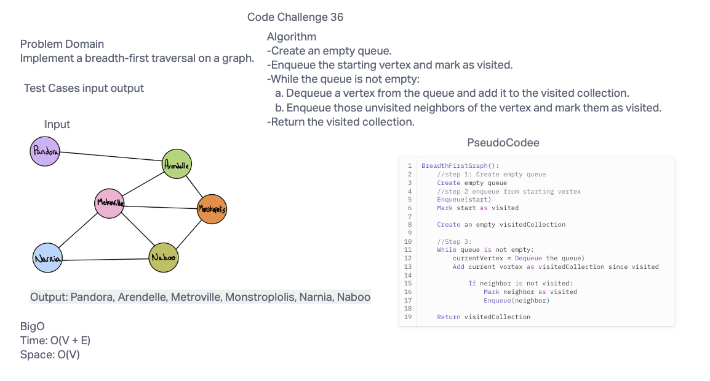

# Code Challenge 36
Implement a breadth-first traversal on a graph.

## Whiteboard Process


## Approach & Efficiency
The Time complexity is O(V + E) and space complexity is O(V).

## Solution
```  public List<Vertex<T>> breadthFirstTraversal(Vertex<T> start) {
    List<Vertex<T>> visited = new ArrayList<>();
    Queue<Vertex<T>> queue = new LinkedList<>();

    queue.add(start);
    visited.add(start);

    while (!queue.isEmpty()) {
      Vertex<T> currVertex = queue.poll();

      for (Edge<T> edge : adjacencyLists.get(currVertex)) {

        Vertex<T> neighbor = edge.destination;

        if (!visited.contains(neighbor)) {
          queue.add(neighbor);
          visited.add(neighbor);
        }
      }
    }

    return visited;
  }```
