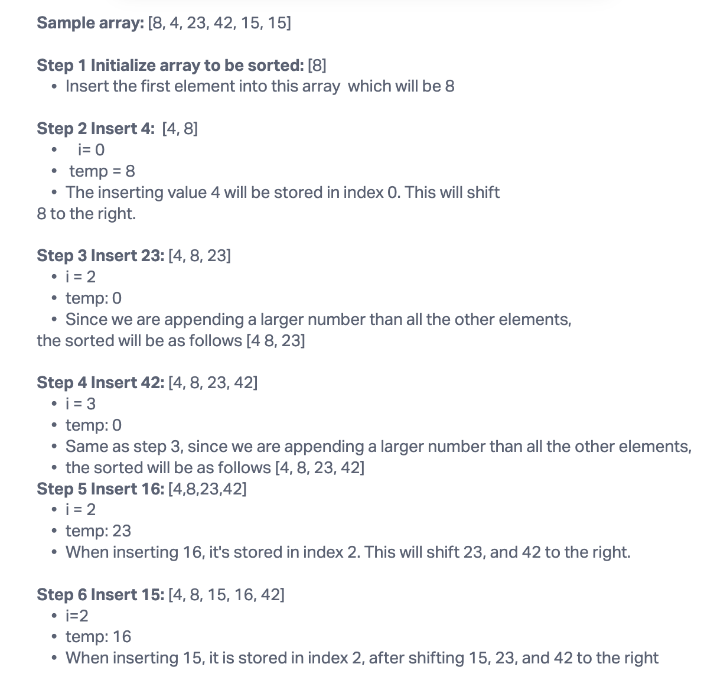

# Code Challenge 26: Insertion Sort

## Pseudocode

```Insert(int[] sorted, int value)
initialize i to 0
WHILE value > sorted[i]
set i to i + 1
WHILE i < sorted.length
set temp to sorted[i]
set sorted[i] to value
set value to temp
set i to i + 1
append value to sorted

InsertionSort(int[] input)
LET sorted = New Empty Array
sorted[0] = input[0]
FOR i from 1 up to input.length
Insert(sorted, input[i])
return sorted
```

## Trace

Sample Array: [8,4,23,42,16,15]


## Blog Post Explanation

In "Insertion Sort," the array is sorted by repeatedly inserting the next unsorted element into its correct position within the already sorted segment. During each insertion, the algorithm identifies the first index where the new element is smaller than the existing values. The element currently at that position is temporarily stored, and the new element will be inserted into its correct spot. This process is repeated for each element in the array until the entire array is sorted.




## Efficiency
Time: O(n -1)
Space: O(1)
