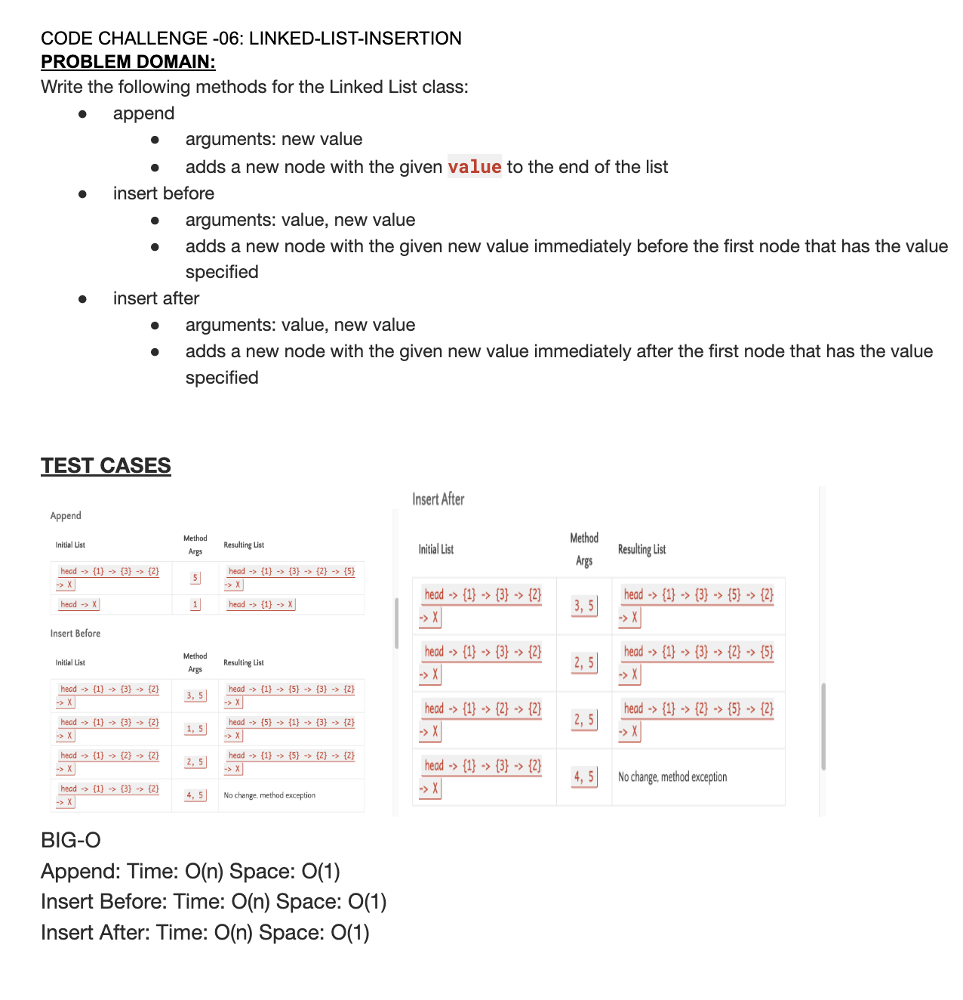

# Code Challenge Linked List Insertion
## Feature Tasks
Write the following methods for the Linked List class:
**append**
arguments: new value
adds a new node with the given value to the end of the list
**insert before**
arguments: value, new value
adds a new node with the given new value immediately before the first node that has the value specified
**insert after**
arguments: value, new value
adds a new node with the given new value immediately after the first node that has the value specified

## Whiteboard Process

## Approach & Efficiency
BIG-O
Append: Time: O(n) Space: O(1)
Insert Before: Time: O(n) Space: O(1)
Insert After: Time: O(n) Space: O(1)

## Solution
[LinkedList & LinkedList insertions](lib/src/main/java/datastructures/linkedlist/LinkedList.java)
[Link to LinkedList Tests](lib/src/test/java/datastructures/linkedlist/LinkedListTest.java)
