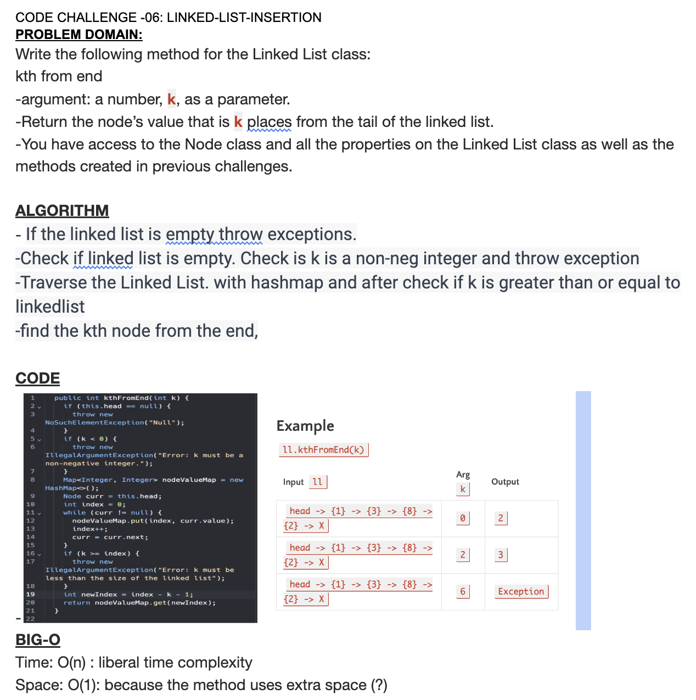

# Code Challenge 07
* Feature Tasks
*
Write the following method for the Linked List class:

* kth from end
* argument: a number, k, as a parameter.
* Return the node’s value that is k places from the tail of the linked list.
* You have access to the Node class and all the properties on the Linked List class as well as the methods created in previous challenges.

## Whiteboard Process

## Approach & Efficiency

Time: O(n) : liberal time complexity
Space: O(1): because the method uses extra space (?)

## Solution
[Lab07-LinkedListKth](https://github.com/jennisung/data-structures-and-algorithms/blob/main/java/datastructures/lib/src/main/java/datastructures/linkedlist/LinkedList.java)
