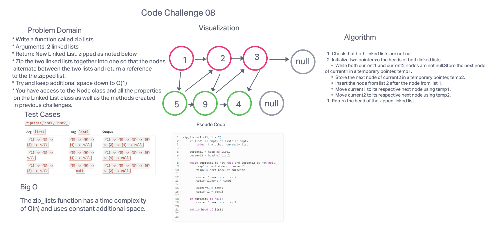

# Code Challenge 08: Zip two linked lists.

## Feature Tasks

* Write a function called zip lists
* Arguments: 2 linked lists
* Return: New Linked List, zipped as noted below
* Zip the two linked lists together into one so that the nodes alternate between the two lists and return a reference to the the zipped list.
* Try and keep additional space down to O(1)
* You have access to the Node class and all the properties on the Linked List class as well as the methods created in previous challenges.

## Whiteboard Process

## Approach & Efficiency
I guess to approach this code challenge we needed to create  function that takes two linked lists and combines them by alternating their nodes, and returns a new linked list with this interlocking nodes.

The zip_lists function has a time complexity

of O(n) and uses constant additional space.

## Solution
