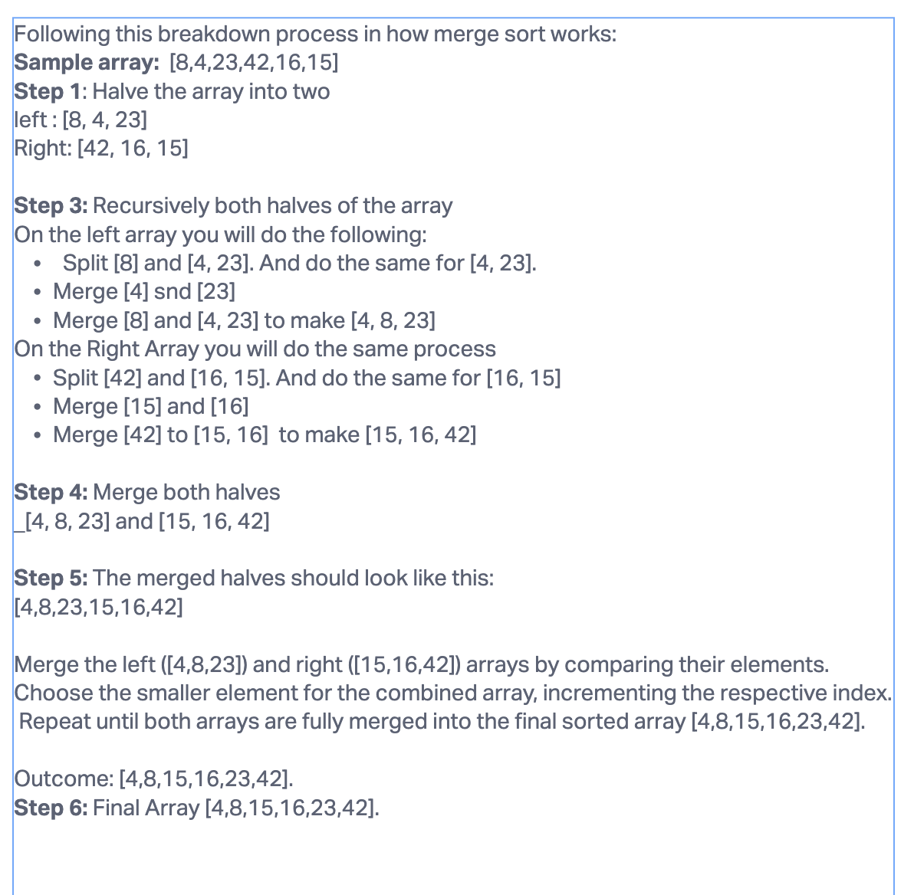

# Code Challenge 27: Merge Sort

## Pseudocode
```agsl
ALGORITHM Mergesort(arr)
    DECLARE n <-- arr.length

    if n > 1
      DECLARE mid <-- n/2
      DECLARE left <-- arr[0...mid]
      DECLARE right <-- arr[mid...n]
      // sort the left side
      Mergesort(left)
      // sort the right side
      Mergesort(right)
      // merge the sorted left and right sides together
      Merge(left, right, arr)

ALGORITHM Merge(left, right, arr)
    DECLARE i <-- 0
    DECLARE j <-- 0
    DECLARE k <-- 0

    while i < left.length && j < right.length
        if left[i] <= right[j]
            arr[k] <-- left[i]
            i <-- i + 1
        else
            arr[k] <-- right[j]
            j <-- j + 1

        k <-- k + 1

    if i = left.length
       set remaining entries in arr to remaining values in right
    else
       set remaining entries in arr to remaining values in left
```

## Trace

Sample Array: [8,4,23,42,16,15]

## Blog Post Explanation

In this blog post, I'll be breaking down the process of how Merge sort works. A simple explanation of this process is that it splits an unsorted array into two halves. Once split, it recursively sorts each half, and then merges the sorted halves back together. It starts by dividing the array until each array contains a single element. Then, once each array contains a single element, it merges the sub-arrays in a sorted order by comparing their elements. This process is repeated until the entire array is merged again and is sorted whole.

