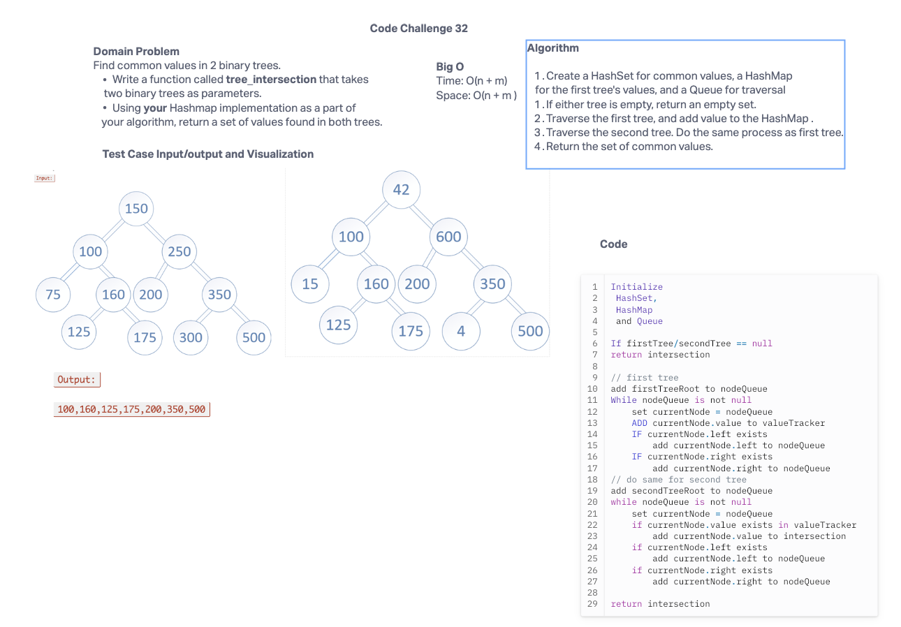

# Code Challenge 32
Find common values in 2 binary trees.

Write a function called tree_intersection that takes
two binary trees as parameters.

Using your Hashmap implementation as a part of
your algorithm, return a set of values found in both trees.


## Whiteboard Process


## Approach & Efficiency

Both Time and Space is:
Time: O(n + m)
Space: O(n + m )

## Solution
```public class TreeIntersection<T extends Comparable<? super T>> {
  public Set<T> treeIntersection(Node<T> firstTreeRoot, Node<T> secondTreeRoot) {
    Set<T> intersection = new HashSet<>();
    Map<T, Boolean> valueTracker = new HashMap<>();
    Queue<Node<T>> nodeQueue = new LinkedList<>();

    if (firstTreeRoot == null || secondTreeRoot == null) {
      return intersection;
    }

    nodeQueue.add(firstTreeRoot);
    while (!nodeQueue.isEmpty()) {
      Node<T> currentNode = nodeQueue.poll();
      valueTracker.put(currentNode.getValue(), true);

      if (currentNode.getLeft() != null) {
        nodeQueue.add(currentNode.getLeft());
      }

      if (currentNode.getRight() != null) {
        nodeQueue.add(currentNode.getRight());
      }
    }


    nodeQueue.add(secondTreeRoot);
    while (!nodeQueue.isEmpty()) {
      Node<T> currentNodeTwo = nodeQueue.poll();
      if (valueTracker.containsKey(currentNodeTwo.getValue())) {
        intersection.add(currentNodeTwo.getValue());
      }

      if (currentNodeTwo.getLeft() != null) {
        nodeQueue.add(currentNodeTwo.getLeft());
      }
      if (currentNodeTwo.getRight() != null) {
        nodeQueue.add(currentNodeTwo.getRight());
      }
    }

    return intersection;
  }

}```
