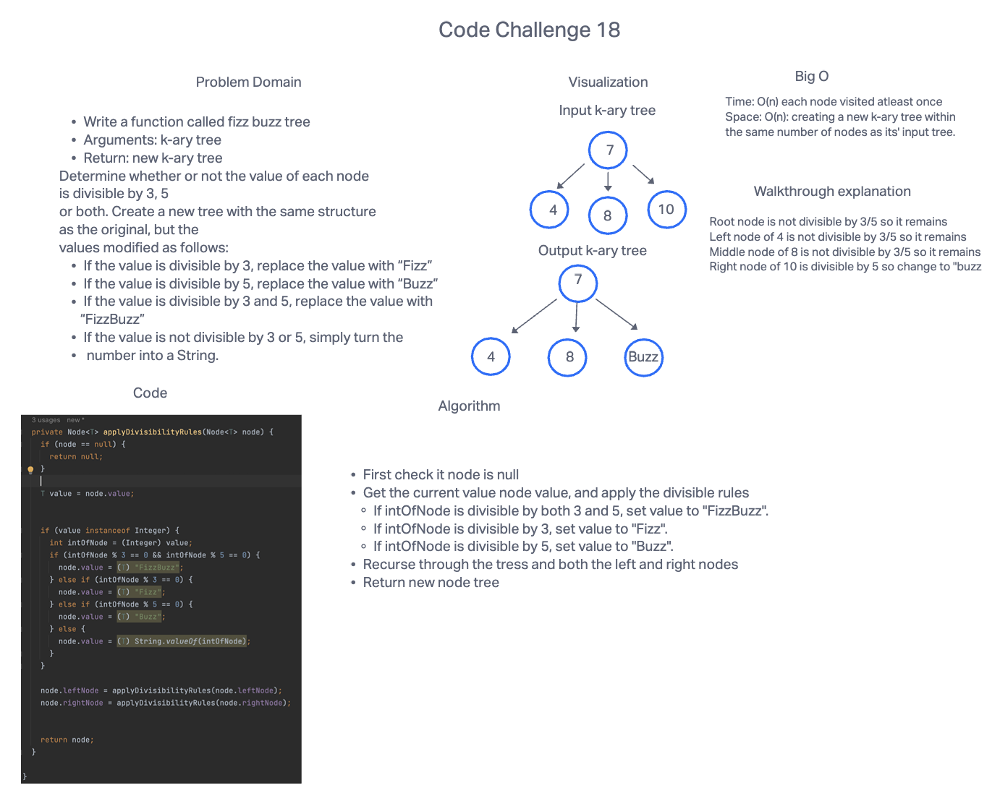

# Code Challenge: Class 18: FizzBuzz
### Feature Tasks

* Write a function called fizz buzz tree
* Arguments: k-ary tree
* Return: new k-ary tree
  Determine whether or not the value of each node is divisible by 3, 5 or both. Create a new tree with the same structure as the original, but the values modified as follows:
* If the value is divisible by 3, replace the value with “Fizz”
* If the value is divisible by 5, replace the value with “Buzz”
* If the value is divisible by 3 and 5, replace the value with “FizzBuzz”
* If the value is not divisible by 3 or 5, simply turn the number into a String.

## Whiteboard Process

## Approach & Efficiency
I guess to approach this problem is to visit all nodes level by level, applying the divisible rules to each node to check their divisibility by 3 or 5, and then return a new node with the rules applied.

The time complexity is O(n) as each node visited atleast once. While the space: complexity is O(n) as we're creating a new k-ary tree with the the same number of nodes as its' input tree.

## Solution
* [Solution](https://github.com/jennisung/data-structures-and-algorithms/blob/main/java/datastructures/lib/src/main/java/datastructures/tree/BinaryTree.java )
