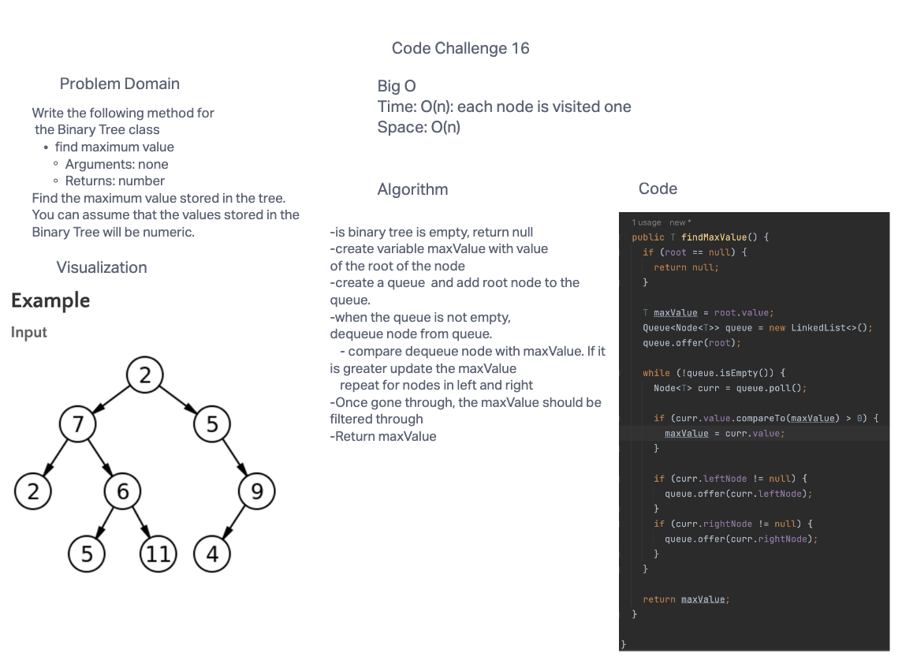

# Code Challenge 16: Find the Maximum Value in a Binary Tree
## Feature Tasks
Write the following method for the Binary Tree class

* find maximum value
* Arguments: none
* Returns: number
  Find the maximum value stored in the tree. You can assume that the values stored in the Binary Tree will be numeric.

## Whiteboard Process

## Approach & Efficiency
I guess my first approach when I read the task, is to find the largest value by starting from the root/top of the tree and navigating down the tree and then compare mnodes values as you go down, and keeping track of the biggest node as you do.
The Big O for time complexity is O(n) as each node is visited once. Space complexity is O(n) due to queue used for BFS traversal.

## Solution

* [Find the Maximum Value in a Binary Tree Solution](https://github.com/jennisung/data-structures-and-algorithms/blob/main/java/datastructures/lib/src/main/java/datastructures/tree/BinaryTree.java )
* [Find the Maximum Value in a Binary Tree Test](https://github.com/jennisung/data-structures-and-algorithms/blob/main/java/datastructures/lib/src/test/java/datastructures/tree/BinaryTreeTest.java)
