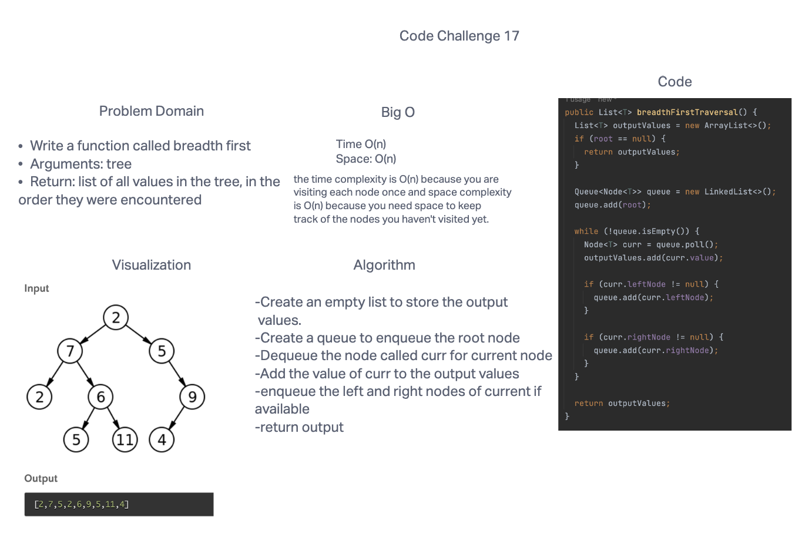

# Code Challenge: Class 17: Breadth-first Traversal.
## Feature Tasks
* Write a function called breadth first
* Arguments: tree
* Return: list of all values in the tree, in the order they were encountered

## Whiteboard Process

## Approach & Efficiency
I guess to approach this problem is to visit all nodes level by level and adding their values to a list till go over each node form top to bottom.
The time complexity is O(n) because you are visiting each node once and space complexity is O(n) because you need space to keep track of the nodes you haven't visited yet.
## Solution

* [Breadth-first Traversal Solution](https://github.com/jennisung/data-structures-and-algorithms/blob/main/java/datastructures/lib/src/main/java/datastructures/tree/BinaryTree.java )
* [Breadth-first Traversal Test](https://github.com/jennisung/data-structures-and-algorithms/blob/main/java/datastructures/lib/src/test/java/datastructures/tree/BinaryTreeTest.java)
